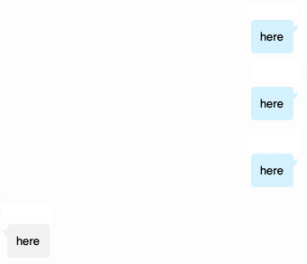
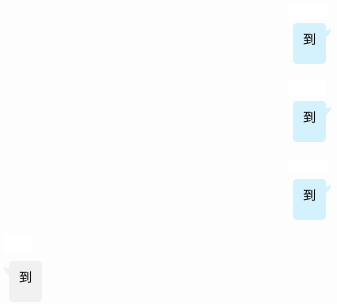
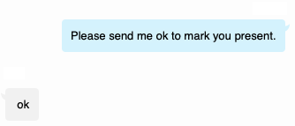
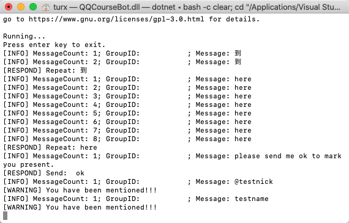
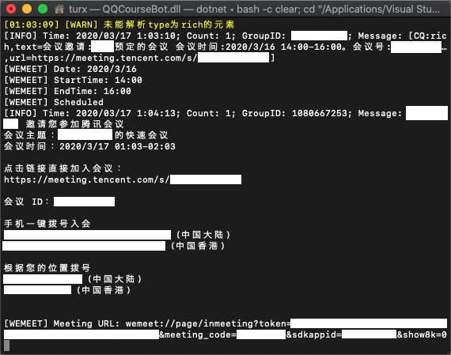
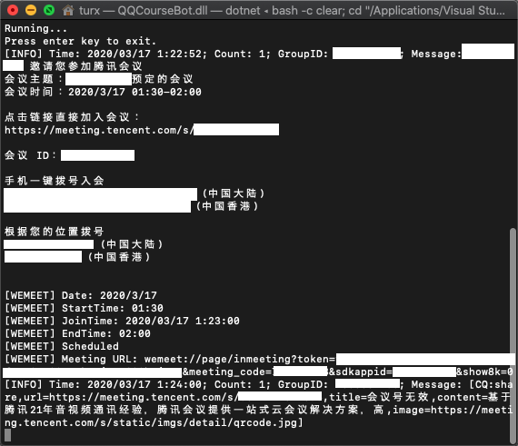

# QQ Robot for Online Courses

copyright by &copy; TURX, licensed by GPL v3.

## Functions

- Auto repeat others' one-word message within several repetitions. (1.0)
- Auto send an one-word message when asked by "please send", "please send me" (1.0), "please send me a", "please send me an", or "please send me one." (1.2)
- Auto respond when being mentioned (1.0) or at (1.2) by others.
- Support multiple groups. (1.1)
- Support JSON configuration. (1.2)
- Support QQ group whitelist. (1.2)
- Auto join Tencent Meeting (support both quick meeting and scheduled meeting and multiple sharing methods) (1.3)

## Screenshots

Repetition in English:



Repetition in Chinese:



Reply when Mentioned:


Response when Asked:



Console Warning:



Auto Joining of Tencent Meetings (app scheduled and text quick):



Auto Joining of Tencent Meetings (link only and text scheduled):



## Dependencies

- .NET Core
- CoolQ
- cqhttp.Cyan (a C# wrapper for cqhttp)
- Docker (optional, for non-Windows systems)
- Newtonsoft.Json

## Usage

You can go to [releases](https://github.com/TURX/QQCourseBot/releases) to download a compiled binary file or you can compile the code for your own situation (for more, read Building section).

```sh
docker pull richardchien/cqhttp:latest # pull the customized CoolQ image to local

docker run -ti --name=coolq --rm -p 9000:9000 -p 5700:5700 -v /path/to/coolq/data:/home/user/coolq -e VNC_PASSWD={PASSWD} -e CQHTTP_POST_URL=http://host.docker.internal:8080 -e CQHTTP_SERVE_DATA_FILES=yes richardchien/cqhttp:latest # run a new customized CoolQ instance; be sure to change path/to/coolq and {PASSWD} to exact values

# Then log in to http://localhost:9000 to log in your QQ account on CoolQ

dotnet /path/to/publish/QQCourseBot.dll # run; be sure to change path/to/publish to exact value

docker rm coolq # terminate previous docker instance
```

## Building

```sh
cd /path/to/sln # change to exact value
dotnet restore # restore NuGet dependency
dotnet build -c Release # use Release configuration to build
dotnet publish -c Release # use Release configuration to publish
cd /path/to/sln/QQCourseBot/bin/Release/netcoreapp{VERSION}/publish # change to exact values
dotnet QQCourseBot.dll # run
```

## Configuration

The json files will be generated if not exist in first run:

- personal.config.json:

Set "Name" to your lowercased real name, "QQ" to your QQ ID.

```json
{
    "Name": "testname",
    "QQ": "123456789"
}
```

- response.config.json:

Set responses to send when being mentioned.

```json
[
    "My internet is poor.",
    "I am restarting my router.",
    "My device has no battery now."
]
```

- whitelist.config.json:

Use the following (default) configuration to disable the whitelist function:

```json
[]
```

Use the following configuration (with whitelisted QQ group IDs) to enable the whitelist function:

```json
[
    123456789,
    234567891,
    345678912
]
```

- meetings.config.json

This file would be auto-written by sending invitation of Tencent Meeting to whitelisted (if enabled, if not, any) groups.

You can also do some cleanups, removing unnecessary items from this file, to enhance the performance of the robot.
